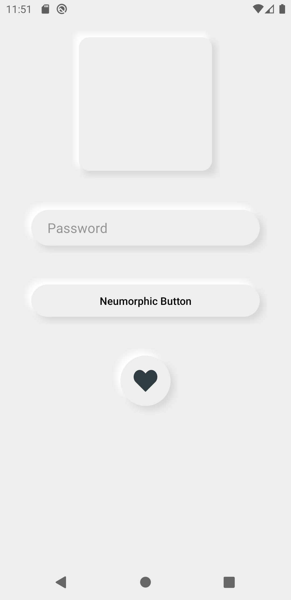
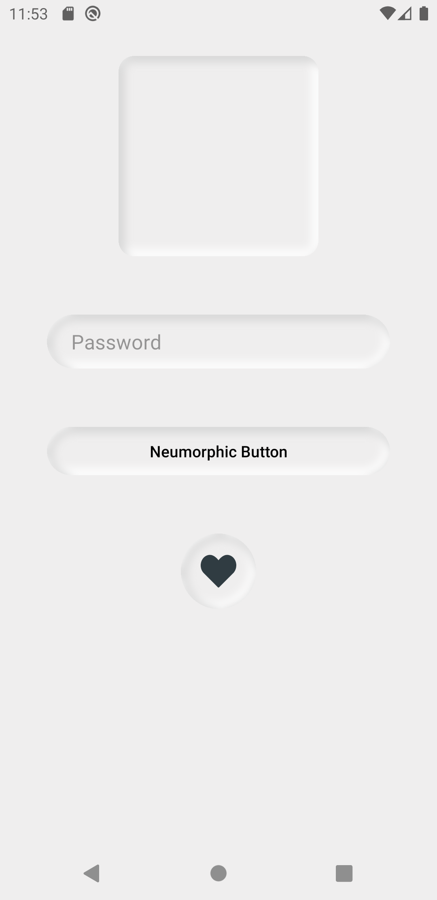
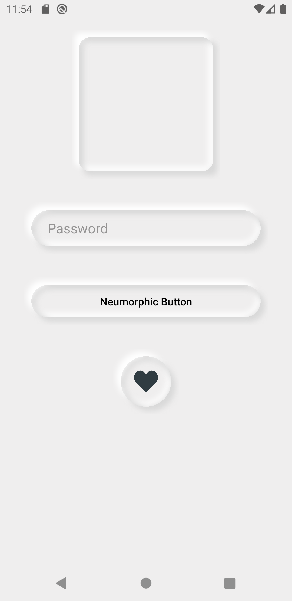
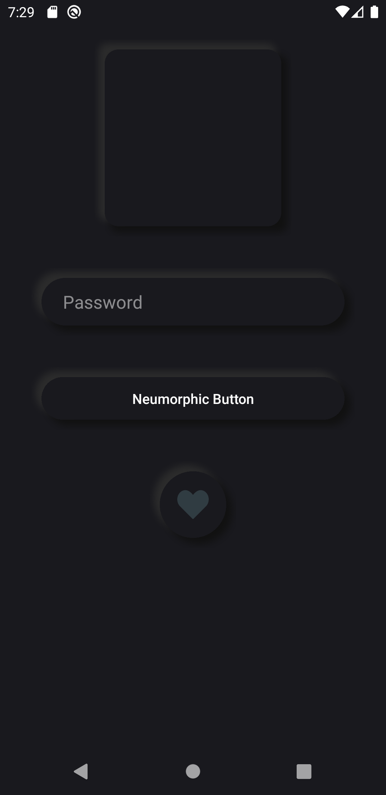
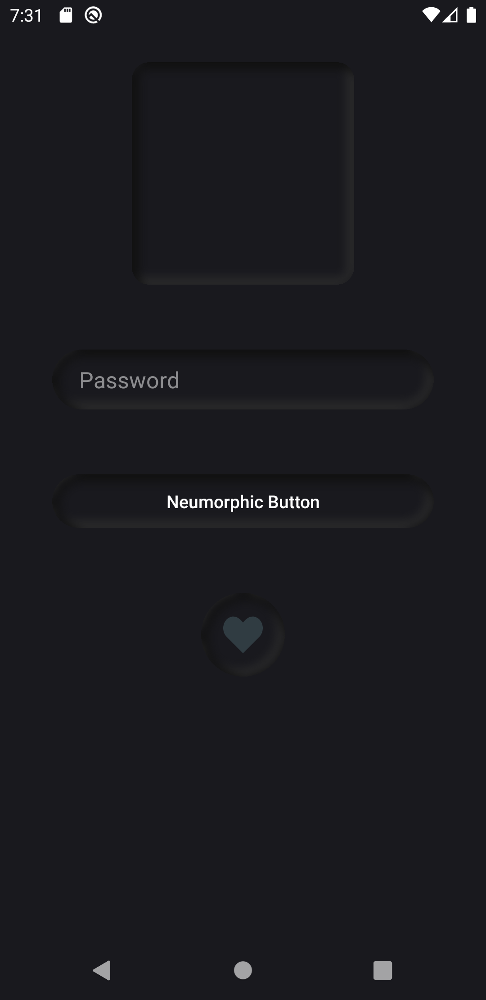
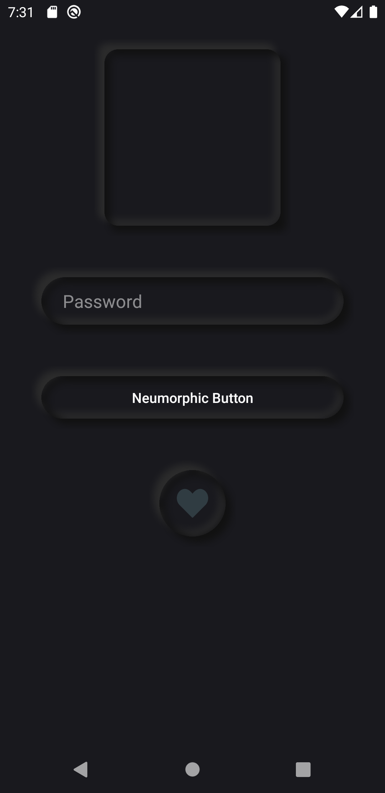

# SSAndroidNeumorphicKit

SSNeumorphicKit is to build Neumorphism design UI in Android.

[](https://kotlinlang.org)  [](https://www.android.com/) [](https://android-arsenal.com/api?level=21)

## Demo
------------------------
* ### Light Mode
<div style="padding: 10px">
    
    
    
</div>

* ### Dark Mode
<div style="padding: 10px">
    
    
    
</div>

## Features
------------------------

* Components
    * NeumorphicCardView
    * NeumorphicButton
    * NeumorphicImageView
    * NeumorphicImageButton
    * NeumorphicFloatingActionButton
    * NeumorphicEditText

* Dark and Light mode support. 
    * Extend theme with ```Theme.SSNeumorphic.DayNight```

## Gradle Dependency
------------------------

* Add it in your <b>root</b> level build.gradle at the end of repositories:

```
allprojects {
    repositories {
        ...
        maven { url 'https://jitpack.io' }
    }
}
```

* Add the dependency in your <b>app</b> level build.gradle.

```
dependencies {
	implementation 'com.github.simformsolutions:SSAndroidNeumorphicKit:1.0.0'
}
```

## Attributes
------------------------

| Attribute | Description | Default
| --- | --- | --- |
| `ss_neumorphic_backgroundColor` | Set background color | `#EFEEEE` |
| `ss_neumorphic_strokeColor` | Set stroke color | N/A |
| `ss_neumorphic_strokeWidth` | Set stroke width | `0dp` |
| `ss_neumorphic_shapeType` | Set shape type | `flat` |
| `ss_neumorphic_inset` | Set all sides inset | `10dp` |
| `ss_neumorphic_insetStart` | Set start inset | `10dp` |
| `ss_neumorphic_insetEnd` | Set end inset | `10dp` |
| `ss_neumorphic_insetTop` | Set top inset | `10dp` |
| `ss_neumorphic_insetBottom` | Set bottom inset | `10dp` |
| `ss_neumorphic_shadowElevation` | Set elevation of the shadow | `6dp` |
| `ss_neumorphic_shadowColorLight` | Set light shadow color | `#ffffff` |
| `ss_neumorphic_shadowColorDark` | Set dark shadow color | `#d9d9d9` |
| `ss_neumorphic_noShadow` | Set to hide shadow | `false` |
| `ss_neumorphic_shapeAppearance` | Set shape appearance of the component | `ShapeAppearance.SSNeumorphic.ComponentName` |

## Usage
------------------------

```xml
<!--  Apply Widget.SSNeumorphic.CardView.Clickable style for click effect.  -->
<com.simformsolutions.ssneumorphic.component.SSNeumorphicCardView
        android:id="@+id/neumorphicCardView"
        style="@style/Widget.SSNeumorphic.CardView"
        android:layout_width="200dp"
        android:layout_height="200dp"
        app:ss_neumorphic_shapeAppearance="@style/ShapeAppearance.MyShape" />

<!--  styles.xml  -->
<style name="ShapeAppearance.MyShape">
    <item name="ss_neumorphic_cornerFamily">rounded</item>
    <item name="ss_neumorphic_cornerRadius">8dp</item>
    <item name="ss_neumorphic_cornerRadiusTopLeft">22dp</item>
    <item name="ss_neumorphic_cornerRadiusBottomRight">22dp</item>
</style>
```

## Find this library useful? :heart:
------------------------

Support it by joining __[stargazers](https://github.com/SimformSolutionsPvtLtd/SSAndroidNeumorphicKit/stargazers)__ for this repository. :star:

## iOS Library
------------------------

Check our iOS version on [Github](https://github.com/SimformSolutionsPvtLtd/SSNeumorphicKit)

## License
------------------------

```
Copyright 2020 Simform Solutions

   Licensed under the Apache License, Version 2.0 (the "License");
   you may not use this file except in compliance with the License.
   You may obtain a copy of the License at

       http://www.apache.org/licenses/LICENSE-2.0

   Unless required by applicable law or agreed to in writing, software
   distributed under the License is distributed on an "AS IS" BASIS,
   WITHOUT WARRANTIES OR CONDITIONS OF ANY KIND, either express or implied.
   See the License for the specific language governing permissions and
   limitations under the License.
```